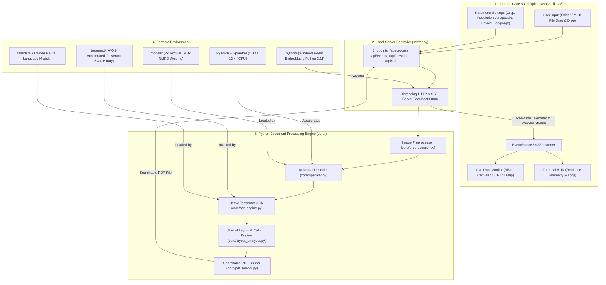

# ChainPDF — Local & Offline Searchable OCR Studio

[](chainpdf.html)
[](chainpdf.html)
[](chainpdf.html)
[-10b981?style=flat-square)](chainpdf.html)

**ChainPDF** is an air-gapped, fully portable document processing studio that converts batches of raw scanned images into fully searchable, selectable, and archivable PDF documents.

Running on a **self-contained embedded Python runtime** with a **native portable Tesseract OCR engine** and **AI-powered deep learning neural upscalers**, ChainPDF processes sensitive records, books, legal documents, and receipts with zero server telemetry or third-party cloud communication — guaranteeing **100% data privacy and offline security**.

---

## Table of Contents

- [Overview](#overview)
- [Key Features](#key-features)
- [Architecture & Processing Pipeline](#architecture--processing-pipeline)
- [AI Neural Super-Resolution & Models](#ai-neural-super-resolution--models)
  - [Supported Neural Models](#supported-neural-models)
  - [Operational Modes](#operational-modes)
  - [Hardware Acceleration & Device Selection](#hardware-acceleration--device-selection)
  - [Seamless Tiled Inference & VRAM Safety](#seamless-tiled-inference--vram-safety)
  - [Sub-Pixel Ink Hole Healing (Anti-Dither)](#sub-pixel-ink-hole-healing-anti-dither)
- [Modules & Dependencies](#modules--dependencies)
- [Project Structure](#project-structure)
- [Getting Started](#getting-started)
  - [1-Click Launch (Recommended)](#1-click-launch-recommended)
  - [Automated Portable Environment Setup](#automated-portable-environment-setup)
- [Technical Capabilities](#technical-capabilities)
  - [Adaptive Ink-Contrast Extraction](#adaptive-ink-contrast-extraction)
  - [Border Auto-Cropping](#border-auto-cropping)
  - [Column & Flow Separation](#column--flow-separation)
  - [Calibrated Invisible Text Overlay](#calibrated-invisible-text-overlay)
- [License](#license)

---

## Overview

Traditional OCR utilities typically rely on external cloud APIs (Google Cloud Vision, AWS Textract, Azure Document Intelligence), exposing confidential papers to third-party servers and network latency. Furthermore, real-world document scans often suffer from low resolution, compression artifacts, blurred lettering, and faded ink that severely degrade OCR accuracy.

**ChainPDF** executes all processing locally inside an embedded, portable Python environment:
- **No Node.js** or external system package managers required.
- **Portable Python 3.11 Runtime** bundled right within the project directory.
- **Integrated AI Super-Resolution Engine** with RealPLKSR and ESRGAN neural network models.
- **Native Tesseract OCR 5.4.0 binary** accelerated by AVX2/AVX vector instruction sets.
- **Modern Cyberpunk Cockpit UI** powered by pure Vanilla HTML5/CSS/JavaScript with real-time Server-Sent Events (SSE) telemetry, laser scanlines, and live dual-monitor preview frames.

---

## Key Features

- **100% Air-Gapped & Local Execution**: Zero API keys, zero cloud telemetry, and zero third-party file uploads. All processing takes place locally on your machine.
- **Embedded Portable Python Runtime**: Runs from a self-contained Python distribution without requiring global Python installation.
- **AI Neural Super-Resolution & Typography Enhancement**:
  - Restores degraded, low-resolution, or blurred scans using deep learning models (**RealPLKSR** and **ESRGAN**).
  - Choice of specialized weights: **2x Text2HD** for ultra-fast text sharpening and **8x NMKD Typescale** for high-ratio typography reconstruction.
  - Flexible enhancement modes: **Auto Upscale (< 1080p only)**, **Always Upscale**, and **Enhanced 1080p** (4K neural upscale with Lanczos super-sampling down to 1080p).
  - Hardware-accelerated inference: **NVIDIA CUDA GPU** acceleration with automatic multi-threaded **CPU fallback**.
  - **Sub-Pixel Ink Hole Healing (Anti-Dither)**: Morphological closing filter that seals convolution pinholes and dither dots inside solid text strokes.
  - **Memory-Safe Tiled Inference**: Evaluates images in overlapping tiles with 2D linear feathering to prevent seam lines and eliminate VRAM exhaustion.
- **AVX2-Accelerated Tesseract OCR**: Native C++ Tesseract engine provides fast character recognition without browser memory limits.
- **Smart Batch Ingestion**:
  - Drag-and-drop entire folders or multiple image files (`.jpg`, `.jpeg`, `.png`, `.webp`, `.bmp`).
  - Recursive folder scanning via HTML5 DataTransfer API.
  - **Natural Alphanumeric Sorting** (e.g., `Page_1.jpg`, `Page_2.jpg` ... `Page_10.jpg` in sequential order).
- **Automatic Border Detection & Crop**: Vectorized edge baseline uniformity inspection detects and trims scanner frames and black borders.
- **Adaptive Ink-Contrast Isolation**: Pre-OCR computer vision filter enhances faded or colored inks while cleaning tinted, yellowed, or noisy scan backgrounds.
- **Multi-Column Reading Order Alignment**: Histogram gutter analysis separates multi-column page layouts (e.g. newspapers, magazines, academic papers), ensuring text selection reads naturally down column 1 before continuing to column 2.
- **Calibrated Invisible Text Layer Injection**:
  - Automatically matches bounding boxes, baseline offsets, and glyph widths using standard Helvetica typography.
  - Injects native invisible text (`render_mode=3`) directly over the visual bitmap using PyMuPDF.
- **Cyberpunk Cockpit HUD & Dual-Mode Monitor**:
  - Live inspection viewport toggling between the **Visual Frame** and the processed **OCR Ink Map**.
  - Built-in Engine Execution Terminal for live event logs streamed in real time via Server-Sent Events (SSE).
- **Resolution Presets**: Target output scaling for 720p (Compact), 1080p (Recommended), 4K (Maximum Detail), or Original unscaled dimensions.

---

## Architecture & Processing Pipeline



---

## AI Neural Super-Resolution & Models

Low-resolution scans, blurry mobile photos, and degraded documents frequently defeat traditional OCR engines. ChainPDF incorporates a dedicated deep learning upscaling engine (`core/upscaler.py`) powered by PyTorch and Spandrel to reconstruct missing typographic details before OCR and PDF compilation.

### Supported Neural Models

The engine supports state-of-the-art super-resolution architectures stored in the `models/` directory (automatically fetched on first use or via `setup_portable_env.bat`):

| Model Name | Architecture | Scale Factor | Weight Size | Best Used For |
|---|---|---|---|---|
| **2x Text2HD** (`2x_Text2HD_v.1-RealPLKSR.pth`) | **RealPLKSR** | $2\times$ | ~29 MB | **Ultra-fast text sharpening** and clean edge restoration. Recommended for high-volume batches and general document scans. |
| **8x NMKD Typescale** (`8x_NMKD-Typescale_175k.pth`) | **ESRGAN** | $8\times$ | ~64 MB | **Deep typographic contour reconstruction**. Ideal for heavily pixelated, tiny, or severely degraded historical fonts. |

### Operational Modes

You can configure the AI upscaling behavior directly in the cockpit HUD:

- **Auto Upscale (< 1080p only) [Recommended Default]**:
  Intelligently checks input resolution against 1080p boundaries ($1920 \times 1080$ landscape or $1080 \times 1920$ portrait). If a page already meets or exceeds 1080p, neural upscaling is bypassed to save time and compute. Only sub-1080p pages are routed to the model.
- **Regular Upscale (Always Upscale All Pages)**:
  Forces neural enhancement on every ingested page regardless of resolution.
- **Enhanced 1080p (4K Neural Super-Sampling to 1080p)**:
  Upscales the input into the $4\text{K}$ neural domain ($3840 \times 2160$), allowing the neural model to hallucinate crisp stroke geometry and eliminate blur. The enhanced image is then supersampled back down to $1080\text{p}$ using high-fidelity Lanczos resampling. This produces razor-sharp, anti-aliased character edges without bloating final PDF file size.
- **Disabled (Standard OCR)**:
  Passes raw/cropped images directly to Tesseract without deep learning overhead.

### Hardware Acceleration & Device Selection

- **GPU (NVIDIA CUDA Acceleration)**: Uses PyTorch CUDA 12.4 with automatic GPU memory release (`torch.cuda.empty_cache()`) between passes. Achieves multi-megapixel inference in sub-second to low-second times.
- **CPU (Multi-Threaded Host Processor)**: Seamless fallback when no NVIDIA GPU or CUDA runtime is present. Automatically adjusts tile sizes to ensure smooth execution on standard multi-core processors.

### Seamless Tiled Inference & VRAM Safety

To prevent Out-Of-Memory (OOM) errors on large high-DPI scans, the upscaler dynamically splits images into overlapping tiles:
- **Tile Dimensions**: $512\text{px}$ on CUDA GPU, $256\text{px}$ on CPU.
- **Overlap Padding**: $24\text{px}$ (GPU) / $16\text{px}$ (CPU).
- **2D Linear Feathering Window**:
  $$\text{Window}_y = \text{linspace}(0.01, 1.0, \text{pad}) \quad\times\quad \text{Window}_x = \text{linspace}(0.01, 1.0, \text{pad})$$
  Adjacent tiles are smoothly blended together in tensor memory, eliminating visible grid seam artifacts across document text blocks.

### Sub-Pixel Ink Hole Healing (Anti-Dither)

Certain sub-pixel convolution / PixelShuffle layers in deep learning super-resolution models can introduce microscopic 1–2px "pinholes" or mottled dither artifacts inside solid dark character strokes.

ChainPDF includes an optional GPU-accelerated morphological anti-dither filter:
1. **Luminance Inversion**: Inverted luminance channel $\text{inv\_Y} = 1.0 - (0.299R + 0.587G + 0.114B)$.
2. **Morphological Closing**: Dilation followed by erosion over a $3\times 3$ kernel to bridge sub-pixel voids:
   $$\text{dilated} = \max\text{pool}_{2\text{d}}(\text{inv\_Y}, k=3, s=1, p=1)$$
   $$\text{closed} = -\max\text{pool}_{2\text{d}}(-\text{dilated}, k=3, s=1, p=1)$$
3. **Local Smoothing**: Blends closed output with $3\times 3$ average pooling to normalize sub-pixel dither:
   $$\text{smoothed} = 0.5 \times \text{closed} + 0.5 \times \text{avg\_pool}_{2\text{d}}(\text{closed}, 3\times 3)$$
4. **Selective Infill & Tone Retention**:
   $$\text{healed\_inv\_Y} = \max(\text{inv\_Y}, \text{smoothed})$$
   RGB channels are proportionally scaled by $\text{healed\_Y} / Y$ to strictly maintain original ink colors while sealing stroke pinholes.

---

## Modules & Dependencies

| Module / Component | Version / Location | Role & Purpose |
|---|---|---|
| **Embedded Python** | Python 3.11.9 (`python/`) | Portable Windows 64-bit Python runtime providing complete self-contained execution. |
| **PyTorch (`torch`, `torchvision`)** | v2.0+ (CUDA 12.4 / CPU) | Hardware-accelerated tensor operations and deep learning neural model inference. |
| **Spandrel & Extra Arches** | v0.4.0+ | Universal model weight loader supporting RealPLKSR, ESRGAN, and Compact neural architectures. |
| **AI Model Weights** | `models/` (~93 MB total) | Pre-trained weights for `2x_Text2HD` (RealPLKSR) and `8x_NMKD` (ESRGAN). |
| **Portable Tesseract** | Tesseract 5.4.0 (`tesseract/`) | High-speed C++ OCR engine with AVX2/AVX hardware optimization. |
| **PyMuPDF (`fitz`)** | v1.28.2 | C++ accelerated PDF compiler for embedding visual images and calibrated invisible text layers. |
| **Pillow (PIL)** | v12.3.0 | Image decoding, format conversions, and Lanczos resolution scaling. |
| **NumPy** | v2.2.3 | Vectorized array operations for scanner edge detection, auto-cropping, and adaptive ink-contrast filtering. |
| **PyTesseract** | v0.3.13 | Python bridge interface to the local Tesseract binary. |
| **Cockpit HUD** | `chainpdf.html` | Pure Vanilla HTML5/CSS/JavaScript interface (no Node.js, no bundlers, no npm). |

---

## Project Structure

```
Chain-PDF/
├── chainpdf.html           # Single-page cyberpunk cockpit UI (HTML, CSS, JS)
├── server.py               # Multi-threaded Python HTTP and SSE server
├── requirements.txt        # Python dependencies specification
├── launch.bat              # One-click studio launcher
├── setup_portable_env.bat  # Automated portable environment setup script
├── core/                   # Core Python document processing package
│   ├── __init__.py
│   ├── preprocessor.py     # Border auto-crop and adaptive ink-contrast filter
│   ├── upscaler.py         # AI neural super-resolution, tiled inference & ink hole healing
│   ├── ocr_engine.py       # Tesseract OCR engine wrapper
│   ├── layout_analyzer.py  # Word stitching and multi-column separation
│   ├── pdf_builder.py      # PyMuPDF searchable PDF builder
│   └── pipeline.py         # End-to-end processing pipeline orchestrator
├── models/                 # Neural super-resolution weights (RealPLKSR & ESRGAN)
├── python/                 # Embedded Python 3.11 runtime (created by setup)
├── tesseract/              # Portable Tesseract 5.4.0 binary (created by setup)
├── tessdata/               # OCR trained language models (eng.traineddata)
└── README.md               # Documentation
```

---

## Getting Started

### 1-Click Launch (Recommended)

Simply double-click:
```cmd
launch.bat
```
This batch script will:
1. Detect if the embedded Python runtime is ready. If not, it automatically runs `setup_portable_env.bat`.
2. Start the local Python server on `http://localhost:8000/`.
3. Open your default web browser directly to the ChainPDF cockpit.

### Automated Portable Environment Setup

To manually download or refresh the embedded Python environment, PyTorch CUDA wheels, AI model weights, and portable Tesseract binary, double-click:
```cmd
setup_portable_env.bat
```
The script will:
- Download and unpack the Windows 64-bit embedded Python 3.11 runtime.
- Install PyTorch with NVIDIA CUDA 12.4 acceleration (with automatic CPU fallback).
- Install Spandrel, PyMuPDF, Pillow, and PyTesseract.
- Download the neural model weights (`2x_Text2HD` and `8x_NMKD`) directly into `models/`.
- Download and unpack portable Tesseract OCR 5.4.0 and English trained data into `tesseract/` and `tessdata/`.

---

## Technical Capabilities

### Adaptive Ink-Contrast Extraction
Scanned pages often suffer from faint pencil marks, colored ink on tinted parchment, or dark scanner shadows. ChainPDF processes every frame prior to OCR with a vectorized NumPy pixel transformation:
$$\text{Luminance} = 0.299R + 0.587G + 0.114B$$
$$\text{Val} = 0.75 \times \min(R, G, B) + 0.25 \times \text{Luminance}$$
Pixels above the background threshold ($>195$) are washed out to pure white ($255$), while ink pixels below the shadow threshold ($<165$) are intensified ($\times 0.55$), producing ultra-clean letterforms for Tesseract.

### Border Auto-Cropping
Detects uniform border margins by scanning edge baseline uniformity. If a continuous corner-to-corner border transition line is detected within $25\%$ of the image perimeter, the content box is trimmed inward to isolate the document text.

### Column & Flow Separation
Standard OCR tools read multi-column documents horizontally across the entire page width, corrupting the paragraph sequence. ChainPDF partitions the page horizontally into discrete $4\text{px}$ bins to detect empty gutters. Content bounded by gutters is grouped into independent columns and sorted top-to-bottom, keeping banners and side-by-side columns in natural reading sequence.

### Calibrated Invisible Text Overlay
To ensure selecting text in a PDF viewer matches the visual ink on screen:
1. Bounding box coordinates $[x_0, y_0, x_1, y_1]$ are scaled to the target PDF canvas.
2. Character widths are matched using standard Helvetica typography metrics.
3. The text baseline is compensated for font ascent:
   $$Y_{\text{baseline}} = y_0 + (\text{LineHeight} \times 0.79)$$
4. Characters are placed with `render_mode=3` (invisible text in PDF specification), creating a 100% searchable and selectable text layer over the visual bitmap.

---

## License

This project is licensed under the [MIT License](LICENSE).
Tesseract OCR is licensed under the Apache-2.0 License.
PyMuPDF is licensed under the GNU AGPL/Commercial license.
